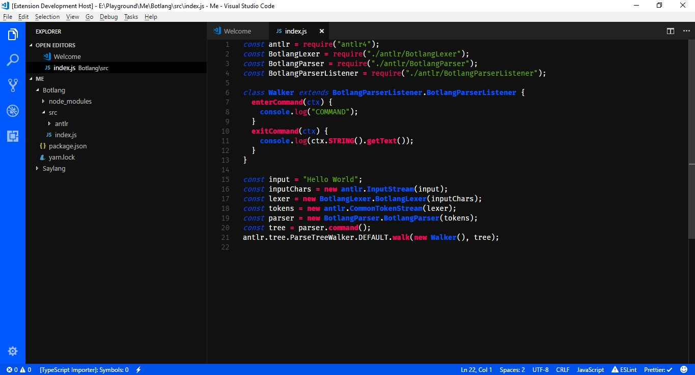
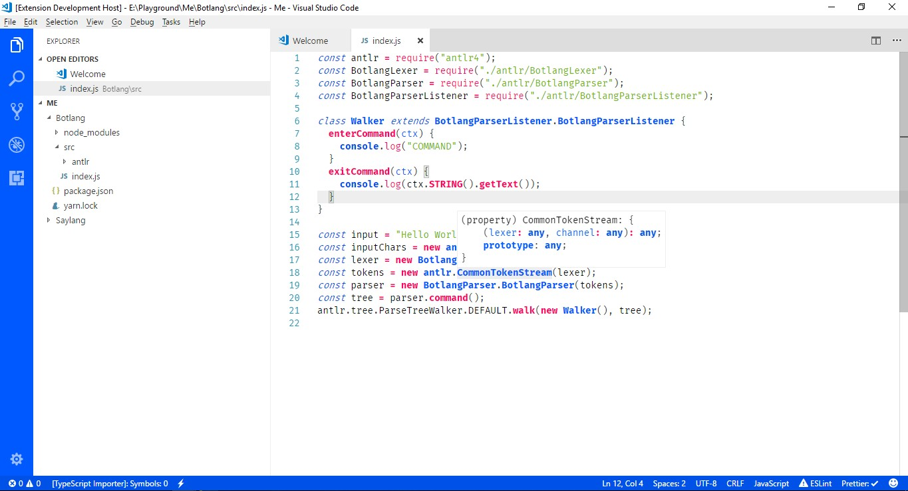

# README

## Myriatek Scheme

Myriatek scheme  is a color scheme made for Visual Studio Code that embraces
Myriatek's design philosophy.

The scheme include two styles, dark and light.

### Preview

